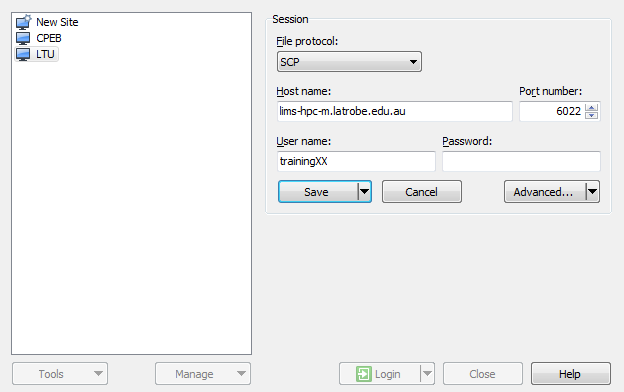
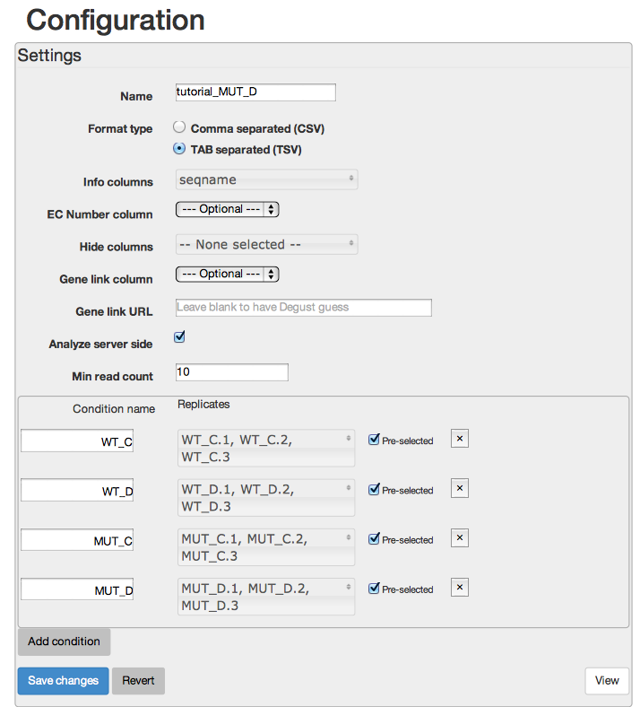
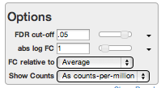

<style src="../../includes/media/tute.css" ></style>
<style>em {font-style: normal; font-family: courier new;} h2 {font-size: 24px; font-weight: bold} h3 {font-size: 18px; font-weight: bold} h4 {font-size: 16px; font-weight: bold}</style>

# Transcriptomics Workshop

**La Trobe University October 2015**

**Authors**:  Nathan Hall &amp; Andrew Robinson

##1. Background

This Workshop is designed to be run over one and a half days.  No prior bioinformatics or unix knowledge is required.

### Intro to Sequencing - where does the data come from

The workshop will start lecture overview of where the data comes from, (Illumina technologies) and what types of transcriptomics experiments can be performed.

### Your Computer

The following programs will need to be installed on your computer to complete this tutorial.  If you are waiting for something to complete, feel free to install these programs ahead of time.

#### Mac & Unix

* IGV <a href="http://www.broadinstitute.org/software/igv/" target=_blank >[download]</a>
* bandage <a href="https://github.com/rrwick/Bandage/releases/" target=_blank > [download]</a>

#### Windows

* putty <a href="http://the.earth.li/~sgtatham/putty/latest/x86/putty.exe" target=_blank >[download]</a>
* winscp <a href="https://winscp.net/download/winscp575setup.exe" target=_blank >[download]</a>. You will have to install onto C drive by choosing non-standard installation
* IGV <a href="http://www.broadinstitute.org/software/igv/" target=_blank >[download]</a>.  Download the binary distribution
* bandage <a href="https://github.com/rrwick/Bandage/releases/" target=_blank >[download]</a>

If you are installing onto the room computers, install everything on the desktop.

###Remote log in

In this topic we will learn how to connect to a *Unix* computer via a method called *SSH* and run a few basic commands.

To begin this workshop you will need to connect to an HPC.  Today we will use the LIMS-HPC.  The computer called 
*lims-hpc-m* (m is for master which is another name for head node) is the one that coordinates all the HPCs tasks.

**Server details**

* **host**: lims-hpc-m.latrobe.edu.au
* **port**: 6022 
* **username**: trainingXX (where XX is a two digit number, provided at workshop)
* **password**: (provided at workshop) 

{!docs/includes/connecting.md!}


###Basic Unix commands:

* ***cd*** - change directory
* ***cp*** - copy files
* ***ls*** - list files in a directory
* ***more*** - look at the contents of a file, *space bar* to proceed to next page,  *q* to quit.

###Workshop files

The files required for the workshop have already been copied into the training accounts.  Type the following commands

```sh
ls -l 
```
this gives you a list of the files already in your directory.  We will go through the contents of these files as we proceed through the workshop.

###Test data set

This workshop is using real 100 bp single end Illumina HiSeq data for *Col-0* arabidopsis, but reads are limited to chromosome 1 of the genome to make the data files and computational time more manageable.  The data file chr1.fastq has over 2 million reads.  Typical read counts for a basic experiment is 15-20 million reads.

###Fastq file format

line1: @sequence_name <br/>
line2: sequence string<br/>
line3: + character<br/>
line4: quality string<br/>

Quality encoding ordered lowest quality to highest quality:   
 <div class="info"><pre>!"#$%&'()*+,-./0123456789:;<=>?@ABCDEFGHIJKLMNOPQRSTUVWXYZ[\]^_`abcdefghijklmnopqrstuvwxyz{|}~</pre>

<p>example:</p>

<pre>
@HWI-1KL119:131:C4W5NACXX:2:2201:14635:56396
GAAATCGGACGGTTTAGTGAAAATGGAGTATCAAGTTGGGTTTGGGTTCCGTCCGAACGACGAGGAGCTC
+
BB<00;B;7BFFFFBFB;FFBBB;BBB;;BBFBBFBFBBFFFFFFBBBFFFFIIIIIIIFIIIIIIIIFF
</pre>
</div>

You can look at the contents of the fastq file by typing
```sh
more chr1.fastq
```
Type *q* to exit the screen


##2. Data QC

The typical first step of an NGS project is to analyse the quality of the data.  The easiest way to do this is to uses the *fastqc* program

The instructions to the computer are in the *run_fastqc* program that you copied earlier into your directory.  You can see the content of the *run_fastqc* file by typing

```sh
more fastqc
```

Type *q* to exit the screen

A command called *sbatch* tells the computer to execute the *run_fastqc* instructions. The *fastqc* program is loaded using the *module load* command and the program is executed with the last line of the script: with *fastqc filename.fastq*.  Now we will submit this job to the computer.

```sh
sbatch run_fastqc
```
<br>
<div class="info"><p><b>Aside</b>: our computers run the <b>slurm</b> queueing system which uses <em>sbatch</em>, a similar command <em>qsub</em> is used for the <b>PBS</b> queueing system.</div>

<br>
Once you have submitted your job with the *sbatch* command you can see if it has finished by typing the *squeue* command, which lists all the current jobs. You can choose to only see your jobs with the command:
```sh
squeue -u trainingXX
```
where XX is replaced with your training account number. <br/>

Alternatively you can type

```sh
ls -lrt
```

You will see a list of files with the most recent at the bottom of the page
the file that starts with slurm contains the output of your run_fastqc script
You can see the contents of the slurm file by typing

```sh
more slurm-*
```

<div class="info"><p><b>Aside</b>: the <em>*</em> character is a wildcard, so the above command will look at all files that starts with slurm.  At the moment we only have one file, but we can type in the full name to get the file of interest.  There is also the auto complete tab function.  Try typing <em>more slurm</em>, then the <em>tab</em> key to get an auto complete of the slurm file.  <b>Note</b>: auto complete does not work if the results are ambiguous</div>

###Analysing the fastqc output:

The easiest way to to analyes the output of the fastqc job is to download the chr1_fastqc.zip file and visualise through a web browser.  

####Macs
From a mac terminal window (not the lims-hpc window) paste the following command:

```sh
scp -P 6022 trainingXX@lims-hpc-m.latrobe.edu.au:chr1_fastqc.zip ~/Desktop
```

**Note**: You will need to replace XX with your training account number and enter the password when prompted.

On your desktop, double click on the zip file, and then go into the extracted folder and double click on the .html file, and it should open up in your web browser.

####Windows

Install winscp and login using the settings below.  Make sure you have your correct training username



You will then be able to drag the unix files (right screen) onto your local computer (left screen)
The file you need transfer for for this fastqc analysis is *chr1_fastqc.zip*

Once the file is transferred, right click on the file and select extract.  You can then enter the extracted *chr1_fastqc* directory and open the *html* file.

###Analysis
Once the html file is opened in your web browser, the things to look at are:<br/>
Quality:<br/>
GC content:<br/>
overrepresented sequences - this is where adaptors can be noticed, 
you may also want to blast any unknown overrepresented sequences.<br/>


**Note**: these stats are optimised for genomes, NOT transcriptomes, so some things will not conform to expectations, particularly GC content and duplication rate.

<div class="info"><p><b>Aside</b>: Most modern Illumina data does not need quality trimming, but sometimes adaptor and quality trimming is still required.  <em>Trimmomatic</em> is one of the most commonly used trimming programs.</div>

##3. Mapping RNAseq Data
Once we have analysed the raw reads and satisfied ourselves that the data is OK, we can then start the mapping process using the *tophat* and *bowtie* programs.  Here each read is mapped to the reference genome (using bowtie) and then a second round of mapping (tophat) incorporates splice sites.

For this mapping we can submit the job by typing

```sh
sbatch run_tophat
```

Have a look at the contents of this *run_tophat* script with the *more* command.  

After the job has started there will be a tophat directory created. Type 

```sh
cd tophat 
```
to go into the *tophat* directory.  Type *ls -l* to see what is there and use *more* to visualise any files text that are present.

Use *cd dir_name* again to go into any subdirectories, *cd ..* to go up a directory, or just *cd* to go back to your home directory.

Follow the status of your job with the *squeue* command and look at your slurm output file as for the previous job.

When the run has finished, the most important file is *accepted_hits.bam*.
This binary file contains all the the details of the data that maps to the genome including the mapping coordinates.

To look at the text version of this bam file we use the *samtools* program.
First this program needs to be loaded using the *module load* command, and then executed as below (copy and paste this into your terminal/putty window):

```sh
cd ~/tophat
module load samtools-gcc/1.2
samtools view accepted_hits.bam | more
```
Type *q* to get out of the *more* session
We won’t worry about all the details of the sam file at this stage as we will look at some of the more informative fields later today.

Look at the file *align_summary.txt* using the *more* command.  As we are only mapping chr1 reads this is not particularly interesting, but can be informative for full data sets as differing mapping rates across samples can alert you to library problems or other issues.

##4. Visualising mapped data 

This section uses the  Interactive Genome Viewer (IGV) will be used to look at reads that map to the genome.

###Installing IGV on your computer:
Before we can visualise the data, the program needs to be installed locally.

Go to the [IGV webpage](http://www.broadinstitute.org/software/igv/)<br>
You will need to register before you can download the application.  

Windows users will need to run the program by opening *IGV* the *windows batch* file


Once this *run_tophat* script has finished, we can copy the the important files to a local computer and visualise the mapped data interactively.

####Mac:
```sh
scp -P 6022 trainingXX@lims-hpc-m.latrobe.edu.au:tophat/accepted_hits.bam* ~/Desktop
```
**Important**: this copies the bam file and the index file.
```sh
scp -P 6022 trainingXX@lims-hpc-m.latrobe.edu.au:tophat/junctions.bed ~/Desktop
```

####Windows:

Use *winscp* to copy the following files from the *tophat* directory: *accepted_hits.bam*, *accepted_hits.bam.bai*, *junctions.bed*

###Visualisation

Now that *IGV* is installed and the files are transferred onto your computer, you can start IGV and read in the files. Choose the *A. Thaliana (TAIR 10)* genome from the genome menu (top LHS), then *file open* and choose the *bam* file and then the *bed* file.  You do not need to manually read in the *bai* file - this is done automatically.

 *IGV* shows individual reads, with splicing details shown.  Things to see, histogram, splicing, read directions, how genes, introns and exons are displayed, reads that do not match the known genes etc…

Find genes that have alternative splicing, retained introns, have good coverage, bad coverage, have overlapping reads with another gene or are interesting in any other way and record the AT numbers for later in the workshop.


##5. Gene Counting 

Once the data has been mapped, we can count each gene using the program *htseq-count*.
This is a conceptually simple process, where if a read unambiguously maps to a gene, then that gene has one count.  

**Note**: alternative isoforms are ignored for most gene count experiments and counts are for all isoforms combined.

Documentation for *htseq-count* is found here:

[http://www-huber.embl.de/users/anders/HTSeq/doc/count.html](http://www-huber.embl.de/users/anders/HTSeq/doc/count.html)

The final output of htseq-count a table list of genes and their counts and is called *gene_counts.txt* and can be found in the *tophat* directory.  Use the *more* command to look at this file.

Note that we are only mapping to genes on chromosome 1 so many genes have no reads.

You can sort this file in terms of gene counts by using the command:

```sh
sort -k 2 -n gene_counts.txt | more
```

###Further Gene count analysis
Go back to IGV and look at some genes with:

High counts
Middle level counts
Low counts

record a few AT numbers for later in the workshop

#####Reads not counted
When a read is mapped to more than one position in the genome, then this read is not counted by *htseq-count*.  In *IGV*, go to *AT1G11270* to see some reads that are not counted.  The white reads have a zero mapping quality.

<div class="info"><p><b>Info</b>: when you mouse over a read in IGV, it will show you mapping information. Take note of the <em>Cigar</em> string (M=match,  N=gap), <em>mapping quality</em> (50=good, low value=bad) and <em>NH</em> (number of hits, if >1 then mapping is ambiguous).  Google “samtools format” to see all the details </div>
 
Now go to *AT1G11300* and decide on whether you believe the apparent splicing in that gene.

Visualise gene *AT1G64940*.  How many reads should be counted by *htseq-count* for these genes?
Using the grep command below  (grep just extracts the line of the file that matches the string (AT number in this case)
```sh
grep AT1G64930 gene_counts.txt
grep AT1G64940 gene_counts.txt
```
This will give you the counted reads for these genes

Finally type:
```sh
tail gene_counts.txt
```
to see the number of reads that are not counted, and the reasons why:<br/>
no_feature   <br/>
ambiguous    <br/>
alignment_not_unique     <br/>


##6. Differential Gene Expression

Rather that mapping six whole transcriptomes and combining the results, we will use a file that has already been generated called *WT_MUT_counts.tsv*.  This comes from a data set being worked on in the Whelan lab, where a LETM gene has been knocked out and plants are put under a water stress environment.  Visualise this data table with the *more* command. 

We can do simple, but statistically valid differential expression analysis using a web server called *degust*

 <a href="http://vicbioinformatics.com/degust-training/" target=_blank >[http://vicbioinformatics.com/degust-training/]</a>

You will need to copy *WT_MUT_counts.tsv* onto your computer and then upload the data into degust.

Follow these steps: <br/>
1. Upload your *tsv* file<br/>
2. give the dataset a name<br/>
3. *Info columns* is set to *seqname*  <br/>
4. enter *Min Read Count* as *10*<br/>
5. Group replicates using the *Add Condition* button<br/>
6. Press *Save Changes* where you are done.<br/>

I will demonstrate the options of degust and help you interpret the results.




####MDS plot - what is an MDS plot and how do replicates group?

MDS plot, (somewhat like principle component analysis), groups samples on 2D graph on their most variable genes.  Note: The groupings of replicates are not taken into account in this analysis.

You can change the number of genes that are used to calculate the MDS plot. This does not usually have a large effect.

###Differential expression analysis

There are two other tabs which relate to differential expression analysis.  *Expression - parallel coordinates*, and *Expression - MA plot*.  Parallel expression give you a heat map representation, and the MA plot is a measure of differential expression in combination with absolute expression.

You will need to limit the genes you are viewing. *FDR cut off* (false discovery rate) is the main filter, but you can also choose to define an *absolute log FC* filter.  A value of 1 means that you require a two fold difference in expression (see below for explanation of log2 FC).




<div class="info"><p><b>Aside</b>: how to express expression changes : use log2 values<br/>
If a fold change in expression (counts)  is 2, then log2=1<br/>
If a fold change in expression is 4, then log2=2<br/>
If a fold change in expression is 8, then log2=3<br/>
If a fold change in expression is -2, then log2=-1<br/>
If a fold change in expression is -4, then log2=-2<br/>
If a fold change in expression is -8, then log2=-3<br/>
Ratios of expressions (counts) don’t work as two fold reduction is 0.5, <br/>
4 fold reduction is 0.25<br/>
8 fold reduction is 0.125</div>


You can also change the analysis method from *Voom/Limma* to *edgeR*.

<div class="info"><p><b>Aside</b>: Limma and edgeR info<br/>
<b>Voom/Limma</b>: Linear Models for Microarray and RNA-Seq Data<br/>
Voom: http://genomebiology.com/2014/15/2/R29, precision weights unlock linear model analysis tools for RNA-seq read counts<br/>
<b>edgeR</b>: Implements a range of statistical methodology based on the negative binomial distributions, including empirical Bayes estimation, exact tests, generalized linear models and quasi-likelihood tests.</div>

Spend some time interacting with these these pages, exploring what information can be gained from this data.  Look for patterns in the heatmaps, how may these relate to function?


## Day two

##7. Transcriptome Assembly 

When a reference genome is not available, then assembling the reads using programs such as *trinity* is the typical route of analysis.<br/>
http://trinityrnaseq.github.io


This workshop will take the same raw fastq data as was mapped to the genome and assemble it, then analyse some of the transcripts. For the sake of speed, only the first 250 thousand reads are assembled.  These correspond to approximately the first 2.5MB of chromosome 1.

The first step is to make a file with these reads using the *head* command.  We take the first million lines as there are four lines per sequence.<br> 

```sh
head -1000000 chr1.fastq> chr1_250K.fastq
```

Look at the *run_trinity* file and then submit the job:

```sh
sbatch run_trinity
```

The final output file is called *Trinity.fasta* and is in the *trinity* directory
The format of the output fasta file is:
*c203_g1_i1*

*c* represents the contig number - loosely represents a gene<br/>
*g* represents the fragment number of the gene<br/>
*i* represents the isoform or the sequence variant number


##8. Visualising transcripts

The *bandage* visualisation tool can be downloaded from 
[https://github.com/rrwick/Bandage/releases](https://github.com/rrwick/Bandage/releases)
select the version that you require and install

The *Trinity.fasta* file needs to be transferred onto your computer:

####mac

```sh
scp -P 6022 trainingXX@lims-hpc-m.latrobe.edu.au:trinity/Trinity.fasta ~/Desktop
```

####windows
copy the *Trinity.fasta* file, found in the *trinity* directory onto your local computer using *winscp*.


###Running bandage
Open up the *Trinity.fasta* file with the *file/Load graph* menu option.  Then  press the *Draw graph* button.  This may take a little time.  You can search for particular contigs with the *Find nodes* search option.  you can only search at the cXXX level (gene model), you can’t put in the the entire contig name, so make sure you pick the *partial* search option.  You will need to come back to this program after the next step. 


##9. Annotating transcripts 

The best and easiest way to annotate transcript is to use *blast*.   We will now set up a blast job which will compare our assembled transcripts against a database of known arabidopsis proteins.  Firstly, look at the *run_blast* script and then submit the script.

```sh
sbatch run_blast
```

The output of the blast run is found in the text file call *Trinity_blast.txt*.

Take some time looking over the blast output.

Things you might look out for, and record some AT numbers:

1. Correct full length transcripts <br/>
2. Partial transcripts<br/>
3. Alternative splicings<br/>
4. Fragmented assemblies<br/>
5. No hits<br/>
6. Anything else??<br/>

Go back to IGV, and search with the AT number and see how the reads relate to the blast results, comparing genes of first four categories above.  You can also visualise some of these alternatively spliced trinity transcripts in bandage.  <br/>
Try visualising *AT1G02080* and the trinity assembly that matches this protein. See example below to see how to search for this.<br/>
What do some of the alternative transcripts represent?<br/>
How do they look in bandage and what do the reads look like in IGV?

Have a look at *AT1G01030* in *IGV*.  How do you think the this would have assembled?
Type the following command to see the blast hits to this gene.
```sh
more Trinity_blast.txt
#then within the program type the following to search
/AT1G01030
```
If you prefer, you can transfer this file onto your local computer and search it using your favorite text editor.

<div class="info"><p><b>Assembly Note</b>: When transcriptomes are assembled, all the data from all the conditions are usually combined to get a standard reference and minimise gene fragmentation for the low coverage genes.  All reads are then mapped back onto the transcriptome for counting and differential expression analysis</div>


<div class="info"><p><b>Aside</b>: Where did the blast database come from?<br/>

https://www.arabidopsis.org/download/index-auto.jsp?dir=%2Fdownload_files%2FSequences%2FTAIR10_blastsets<br/>
The database was then indexed with the following blast command:<br/>
<em>makeblastdb -in TAIR10_pep_20101214_updated.txt -out TAIR10_pep -title TAIR10_pep -dbtype prot</em></div>

##10. Summary
This is the end of the formal part of the workshop.  This workshop has been designed to give you a greater understanding of the concepts and steps of RNA seq analysis. Things that you should have an understanding about are:<br/>
1. Where does the data come from <br/>
2. What is the quality of the data<br/>
3. How the data is mapped to a reference <br/>
4. How is the data assembled<br/>
5. How are reads turned into counts<br/>
6. What are the basic concepts of differential expression analysis<br/>

This workshop does not cover how to further analyse lists of differentially expressed genes.  The interpretation is often the hardest part of the analysis, and requires different approaches, depending on the experiment.

Remember, the more you understand about the bioinformatics process, the more you can get out of the analysis.


##11.  Individual Project Discussions

Two transcriptome projects are rarely the same, in terms of design and analysis.  This final session gives you the opportunity to discuss aspects of your project, with other attendees and the workshop presenters.


